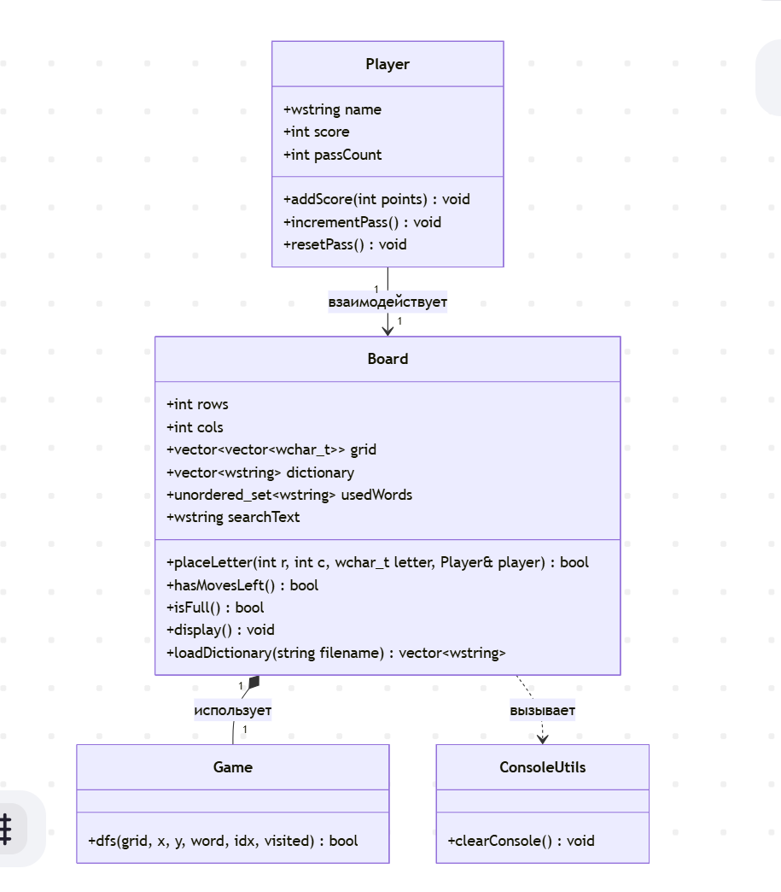
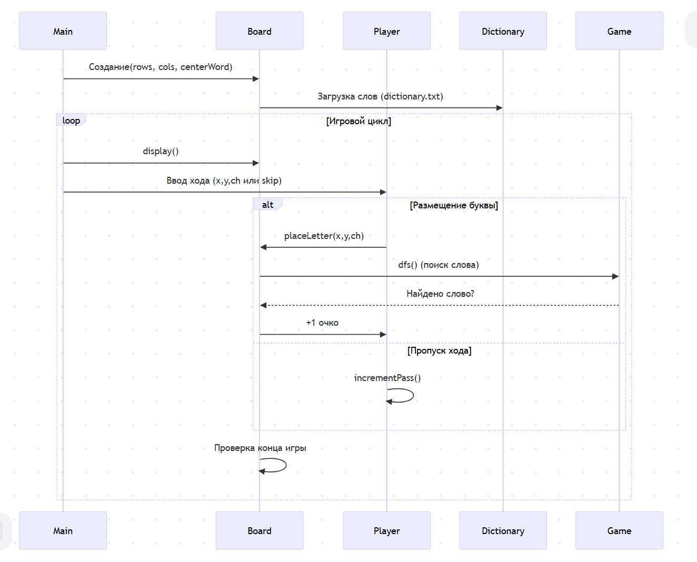
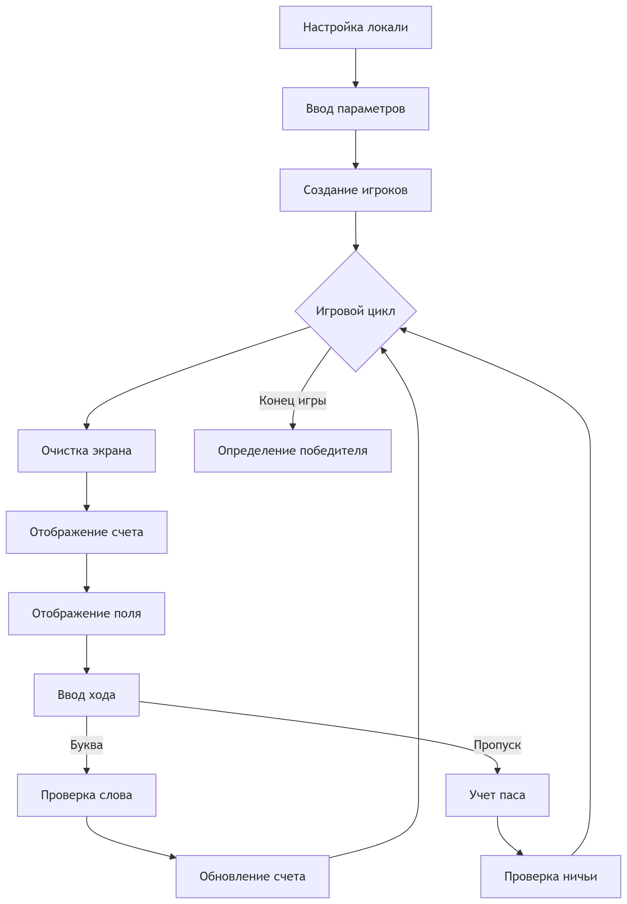

**Пояснительная записка к программе игры "Слова" (вариант "Балда")**

---

### Подключаемые библиотеки и их назначение

* `<iostream>`, `<sstream>` — ввод/вывод в консоли, работа со строковыми потоками.
* `<vector>`, `<string>`, `<set>`, `<unordered_set>`, `<queue>` — структуры данных для поля, словаря, хранения использованных слов и выполнения обхода.
* `<locale>`, `<codecvt>` — настройка локали и кодировщика UTF-8 для корректного ввода/вывода русского текста.
* `<cstdlib>` — системные вызовы (например, очистка консоли).
* `<windows.h>` (для Windows) — установка кодовых страниц консоли (UTF-8).
* `<limits>`, `<ios>` — определение `std::streamsize` и использование `ignore()` для очищения буфера ввода.

---

## Модуль `console_utils`
### Назначение
Очистка консоли для удобного отображения игры.

### Код
```cpp
// console_utils.h
#ifndef CONSOLE_UTILS_H
#define CONSOLE_UTILS_H

void clearConsole(); // Объявление функции очистки

#endif
```

##  Класс `Player`

**Поля:**

* `wstring name` — имя игрока.
* `int score` — накопленный счёт (количество очков).
* `int passCount` — количество подряд пропущенных ходов.

**Методы:**

* `addScore(int points)` — добавить к счёту указанное число очков.
* `incrementPass()` — увеличить счётчик пропусков.
* `resetPass()` — сбросить счётчик пропусков (после удачного хода).

Используется для хранения состояния каждого игрока.

---

## Класс `Board`

**Поля:**

* `int rows, cols` — размеры квадратного поля.
* `vector<vector<wchar_t>> grid` — двумерная сетка символов (буквы или пробел).
* `vector<wstring> dictionary` — набор допустимых слов (загружается из жёстко прописанного списка, впоследствии — из JSON).
* `unordered_set<wstring> usedWords` — множество уже составленных слов, чтобы избежать повторений.
* `wstring searchText` — строка для вывода последнего найденного слова.

**Методы:**

1. `isCellEmpty(r,c)` — проверяет, пуста ли клетка `(r,c)`.
2. `hasAdjacent(r,c)` — проверяет, есть ли рядом (по горизонтали/вертикали) заполненная клетка (требование смежности).
3. `dfs(...)` — рекурсивный поиск слова в сетке: обходит соседние клетки без повторного посещения.
4. `placeLetter(r,c,letter,player)`:

   * Проверяет позицию и смежность.
   * Ставит букву и ищет в словаре слова, содержащие эту букву, через DFS, проверяя, что путь проходит через `(r,c)`.
   * Если слово найдено, заносит его в `usedWords`, сохраняет сообщение в `searchText` и добавляет игроку очки (число букв).
5. `hasMovesLeft()` — симулирует любые одиночные ходы: пробует поставить любую букву из ещё не использованных слов, и, если после этого слово может быть составлено, возвращает `true`.
6. `isFull()` — проверяет, заполнено ли всё поле.
7. `display()` — выводит текущее состояние поля в консоль.

---
## Функция dfs
* Назначение: Алгоритм поиска слова на поле (Depth-First Search)

1. `grid` - ссылка на игровое поле

2. `x, y` - текущие координаты

3. `word` - искомое слово

4. `idx` - текущий индекс в слове

5. `visited` - матрица посещенных ячеек

* Возвращаемое значение: bool (найдено ли слово)
---

## Алгоритм работы `main()`

1. **Настройка локали и кодовой страницы** для корректного отображения UTF-8 (особенно в Windows).
2. **Запрос параметров игры**:
   * Количество игроков.
   * Размер поля (нечетное, ≥3). Если вводится четное, то программа завершается.
   * Стартовое слово (размещается по центру).
3. **Создание игроков и доски**.
4. **Игровой цикл** до окончания:
   * Очистка консоли (`clearConsole()`).
   * Вывод счёта всех игроков и сообщения о последнем найденном слове (`searchText`).
   * Отрисовка поля.
   * Ожидание ввода хода: координаты и буква или `skip`.

     * При `skip` увеличивается счётчик пропусков; при трёхкратном подряд пропуске всеми — ничья.
     * Иначе вызов `placeLetter` — попытка поставить букву; при успехе сбрасываются пропуски.
   * Проверка окончания:

     * Поле заполнено или нет возможных ходов → конец игры.
5. **Объявление победителя** (игрок с максимальным `score`) или ничья.

### UML

---



---
### Ход игры

---


---
### Особенности и расширения

* **Уникальность слов**: используются `usedWords` для исключения повторов.
* **Гибкость словаря**: пока список прописан в коде, легко заменить на загрузку из JSON.
* **Локализация**: UTF-8 гарантирует корректный ввод/вывод кириллицы.
* **Антифлуд очистки экрана**: в Windows вместо `cls` используется заглушка, чтобы не мешать вводу.

### Сложности и проблемы
* Слова по диагонали не считывались и для этого была добавлена функция поиска в глубину.
* Медленная работа DFS на больших полях
* Долгая загрузка словаря(?)


---


